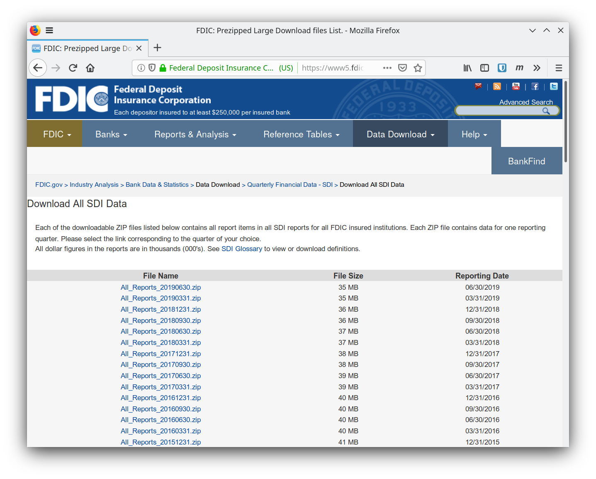
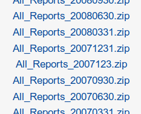

# FDIC SDI Downloader and Extractor

This repository contains two Python programs.
The first downlods some data from the website of the FDIC.
The second walks the downloaded data searching for specific variables and concatenates them into a (compressed) CSV file.
The concatenation happens both horizontally (across variables) and vertically (across time periods).

## Downloader

[This program](./download_sdi_data.py) goes on the website of the US [Federal Deposit Insurance Corporation](http://www.fdic.gov/) (FDIC), which maintains the Statistics on Depository Institutions (SDI).
The objects of interest are the bulk download `.zip` files at [this webpage](https://www5.fdic.gov/sdi/download_large_list_outside.asp).

There are many zip files, and manually downloading them hurts my wrist.
Hence I wrote this [Python](https://www.python.org/)/[BeautifulSoup](https://www.crummy.com/software/BeautifulSoup/) program that does the job for me.

### Main steps of the program

The program is quite easy.
It goes on the website, it parses the HTML table where all the zip files are listed and then reads the links.
Finally, the good-ole [`urllib.request.urlretrieve`](https://docs.python.org/3/library/urllib.request.html#urllib.request.urlretrieve) starts the downloads.
There also is a fancy progress bar, courtesy of [tqdm](https://tqdm.github.io/).

There only is one catch.
At some point, in the HTML table, there is a file with a weird filename.

The file ` All_Reports_2007123.zip` (with a leading whitespace) contains outdated data.
Its name is also badly formed.
If you download and compare both this weird file and the file `All_Reports_20071231.zip`, you will see that the latter contains more up-to-date data.
Hence my program simply ignores the weird file with a ad-hoc `if` statement.

### Note

The downloads are started serially, not in parallel.
This means that, depending on your internet connection, the download of all files may take quite a while.
Luckily, the whole thing is very light on your PC resources, meaning you can easily get back to some other work while this program runs in the background.

### Usage

    $ python3 download_sdi_data.py <download_location>

where `<download_location>` is the folder on your local machine where you want the files to be saved.

## Extractor

Each zip file downloaded contains several `.csv` files.
These files contain cross-sectional data on banks.
The structure of the files reflects the division presented in the [SDI Glossary](https://www5.fdic.gov/sdi/sitemap.asp).

[The extractor](./sdi_dataset_assembler.py) relies on a [`.json` configuration file](./pull_variables.json).
This file has the following structure

    "report_name": <list_of_variable_names>

where `report_name` is the name of the csv file (without the extension string `.csv`) and `<list_of_variable_names>` is a list of variables that are contained in that report.
Essentially, this configuration file tells the extractor to "pull this list of variables from these reports".
To understand what variables are in which report, please refer to the [SDI Glossary](https://www5.fdic.gov/sdi/sitemap.asp).

### Usage

    $ python3 sdi_dataset_assembler.py <zipfiles_dir> <conf_file> <out_filename>

where `<zipfiles_dir>` is the directory that contains the zip files downloaded, `<conf_file>` is the configuration json file and `<out_filename>` is the name of the file you want to obtain.
The latter argument is used by [pandas.to_csv()](https://pandas.pydata.org/pandas-docs/stable/reference/api/pandas.DataFrame.to_csv.html) as its `path_or_buf` input argument, together with `compression='infer'`.
This means that if `<out_filename>` ends in `.csv`, the resulting file will be a simple CSV uncompressed file.
If `<out_filename>` ends in (e.g.) `.csv.xz`, then the CSV file will be automatically compressed with the xz compression method.

## Dependencies

- [Python 3](https://www.python.org/)
- [urllib.request](https://docs.python.org/3/library/urllib.request.html)
- [zipfile](https://docs.python.org/3/library/zipfile.html)
- [BeautifulSoup](https://www.crummy.com/software/BeautifulSoup/)
- [pandas](https://pandas.pydata.org/)
- [tqdm](https://tqdm.github.io/)

## Disclaimer and license

The contents of this repository are disclosed into the public domain under the [_Do What The F*ck You Want To Public License_](https://choosealicense.com/licenses/wtfpl/).
